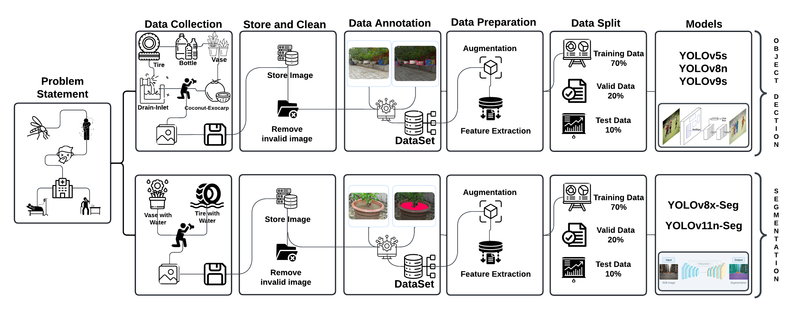
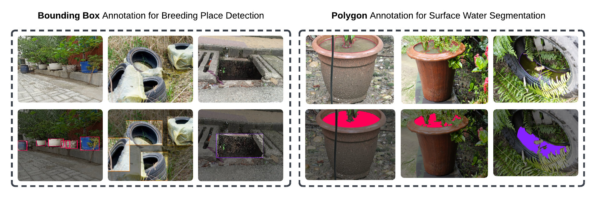

# MED-SAM: Mosquito Ecology Detection and Surface Segmentation Multi-class Dataset

<h2>Dataset Overview</h2>

The MED-SAM dataset is designed to support the detection of mosquito breeding sites and the segmentation of water surfaces in those locations. It consists of two main components:

1. **Breeding Place Detection**: This part includes 1,828 images with 3,752 annotations across five different classes: Coconut-Exocarp, Vase, Tire, Drain-Inlet, and Bottle. Images were collected from various urban, semi-urban, and rural areas in Bangladesh during daylight hours to ensure consistent quality. Technical validation was performed using object detection models such as YOLOv5s, YOLOv8n, and YOLOv9s, with YOLOv5s achieving the highest accuracy.
2. **Water Surface Segmentation:** This component contains 142 images and 253 annotations focused on segmenting water surfaces in two classes: vase_with_water and tire_with_water. The segmentation was validated using the YOLOv8x-Seg and YOLOv11n-Seg models to accurately identify the presence of water in potential breeding sites.

The MED-SAM dataset serves as a valuable resource for developing AI-based solutions aimed at detecting and analyzing mosquito breeding sites, contributing to mosquito control efforts, and the prevention of mosquito-borne diseases. Its combination of object detection and water surface segmentation offers a novel approach to identifying high-risk areas for mosquito proliferation.

<h2>Access the Dataset</h2>

Explore the MED-SAM dataset on Kaggle: <a href="https://data.mendeley.com/datasets/rtsfh7jh7p/1" target="">MED-SAM</a>

<h2>Code</h2>

The notebook called <a href="Code/yolov5s_yolov8n_yolov9s_1.ipynb">yolov5s_yolov8n_yolov9s_1.ipynb</a> is used to train the models YOLOv5s, YOLOv8n, and YOLOv9s for mosquito breeding place detection with the MED-SAM Dataset. And the notebook called <a href="Code/Yolov8x-seg.ipynb">Yolov8x-seg.ipynb</a> is used to train the models YOLOv8x-seg for surface water segmentation with the MED-SAM Dataset.

<h2>Model Weights</h2>

The weight for object detection models are - <a href="Result/Yolov5s/Weight">YOLOv5s</a>, <a href="Result/Yolov5s/Weight">YOLOv8n</a>, and <a href="Result/Yolov5s/Weight">YOLOv9s</a>. The weight for segmentation model <a href="https://drive.google.com/drive/folders/1vjX6ZJbT87Xto4hQ7_dcueQjF9C5DjkI?usp=sharing">YOLOv8x-Seg</a>.

<h2>License</h2>

This dataset is available under <a href="LICENSE">LICENSE</a>. Please review the license before using the dataset for your projects.

<!-- <h2>Cite</h2>

If you use the MED-SAM dataset for your research, please cite it as follows:

<pre>
</pre> -->

<h2>Contact</h2>

For inquiries or feedback, feel free to contact us at mislam221096@bscse.uiu.ac.bd, msayeedi212049@bscse.uiu.ac.bd

</body>
</html>
